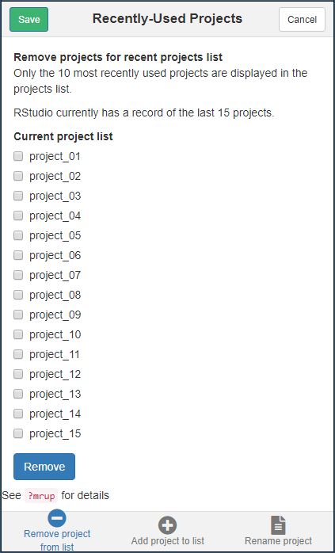
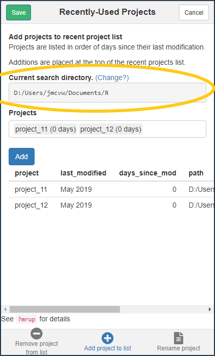
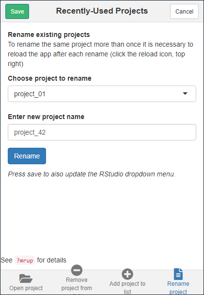

<!-- EDIT IN README.RMD -->

## An RStudio addin for manipulating the "Most Recently Used Projects" list

Easily open any previous project.  
Add projects to, or remove projects from, the recent project drop-down menu.  
Easily rename existing projects without navigating the file system manually.

The RStudio menu shows a list of the 10 most recently used projects.
This is based on the project_mru file which may contain more than 10 projects (apparently 15 max?).

### Install

To install copy the following:

`remotes::install_github('jmcvw/mrup')`

### Use

Click the `Addins` drop down menu

Then locate the `mrup` section and click on the description text below

***

#### Open tab

In the open tab it is possible to open any RStudio project even if it is not on the recently used list.

The directory structure of your computer can be searched and all projects located within the chosen directory are displayed.
The default search location is `~/R`, but this can be changed by clicking the `Change` link.
It may take several seconds to complete the search, with the time increasing the closer you get to  the root directory of a hard disk.
Once completed, a 

The chosen project can then be opened in either the current or a new session.
The chosen directory is also used for the __Add projects__ and __Rename project__ tab.

***

#### Remove tab

The remove tab lists the contents of the current project_mru file, in its entirety.
The means it is possible to see which projects were recently pushed off the bottom, but are still present, on the list.
Any file on the list came be completely removed from it on this tab.

Pressing the <code style='background-color:#337ab7; color:white'>Remove</code> button creates a modified list to replace the current list.
Replacement only takes place if the <code style='background-color:#3cb371; color:white'>Save&nbsp;changes</code> button is pressed.
Pressing `Cancel` discards changes and closes the app.

#### Add tab

Adding new projects to the recently used list requires searching all subdirectories for `.Rproj` files.
The search directory (i.e the circled input) is now chosen ion the __Open project__ tab.
A list of all detected projects is displayed that indicates how long it has been since each project was modified. 
Selected projects are shown in a table that also shows the full path to the project.

Pressing the <code style='background-color:#337ab7; color:white'>Add</code> button creates a list with all selected projects placed at the top of the project list.
Additions only occur if the <code style='background-color:#3cb371; color:white'>Save&nbsp;changes</code> button is pressed.
Since the list can only show 10 projects, those further down will be hidden, but will stay on the project_mru file (for a while at least).
Pressing `Cancel` discards changes and closes the app.

***

#### Rename tab

Any project can be renamed as long as it is located within the directory chosen in the __Open project__ tab.
After renaming, pressing the refresh button allows the list to be updated without restarting the add-in.
When renaming, select one project and enter the new name in the box, without a file extension.
As long as the project directory has the same name as the project itself, both shall be renamed, and the `.Rproj` extension will remain.

The name change is implemented immediately on pressing <code style='background-color:#337ab7; color:white'>Rename</code>, with no need to press <code style='background-color:#3cb371; color:white'>Save&nbsp;changes</code>, and without the ability to cancel.
To undo a rename, the project can be re-renamed straight away, after refreshing the app.

