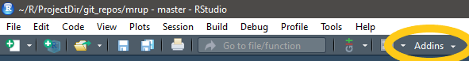
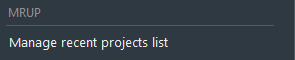

Addin ~ MRUP
================

<!-- EDIT IN README.RMD -->

## An RStudio addin for manipluting the “Most Recently Used Projects” list

The addin allows projects to be added to, or removed from, the recent
project drop-down menu. The addin also makes it possible to rename
existing projects without navigating file system manually.

The RStudio menu shows a list of the 10 most recently used projects.
This is based on the project\_mru file which may contain more than 10
projects (apparently 15 max?).

**NB:** Only projects saved in subdirectories of the `~/R` directory are
found. If you prefer to save projects all over your hard disc, this will
currently not find those projects located elsewhere.

### Install

To install copy the following:

`remotes::install_github('jmcvw/mrup')`

### Use

Click the `Addins` drop down menu

Then locate the `mrup` section and click on the description text below

### Remove tab

The remove tab lists the contents of the current project\_mru file, in
its entirety. The means it is possible to see which projects were
recently pushed off the bottom, but are still present, on the list. Any
file on the list came be completely removed from it on this tab.

Pressing the
<code style='background-color:#337ab7; color:white'>Remove</code> button
creates a modified list to replace the current list. Replacement only
takes place if the
<code style='background-color:#3cb371; color:white'>Save changes</code>
button is pressed. Pressing `Cancel` discards changes and closes the
app.

### Add tab

All subdirectories of the `~/R` directory are searched for`.Rproj`
files, and will likely take a few seconds to complete. Once done, a list
is generated that indicates how long it has been since each project was
modified. Selected projects are shown in a table that also shows the
full path to the project.

Pressing the
<code style='background-color:#337ab7; color:white'>Add</code> button
creates a list with all selected projects placed at the top of the
project list. Additions only occur if the
<code style='background-color:#3cb371; color:white'>Save changes</code>
button is pressed. Since the list can only show 10 projects, those
further down will be hidden, but will stay on the project\_mru file (for
a while at least). Pressing `Cancel` discards changes and closes the
app.

### Rename tab

Because searching for all files takes some time, only projects already
on the list can be renamed. Using the refresh button allows the list to
be updated without restarting the add-in. When renaming, select one
project and enter the new name in the box, without a file extension. As
long as the project directory has the same name as the project itself,
both shall be renamed, and the `.Rproj` extension will remain.

The name change is implemented immediately on pressing
<code style='background-color:#337ab7; color:white'>Rename</code>, with
no need to press
<code style='background-color:#3cb371; color:white'>Save changes</code>,
and without the ability to cancel. To undo a rename, the project can be
re-renamed straight away.
